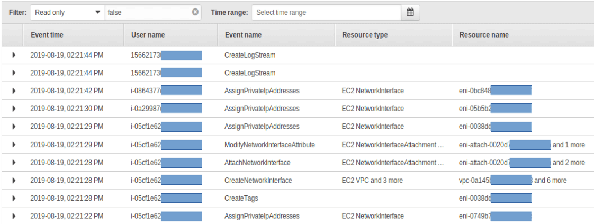
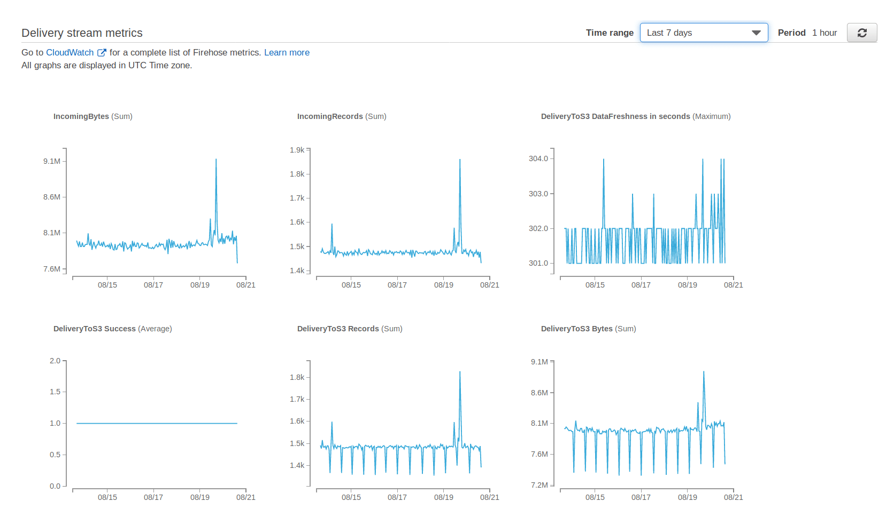
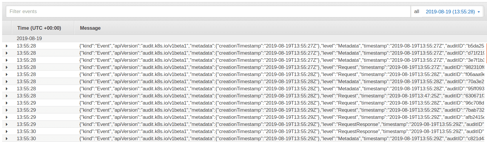
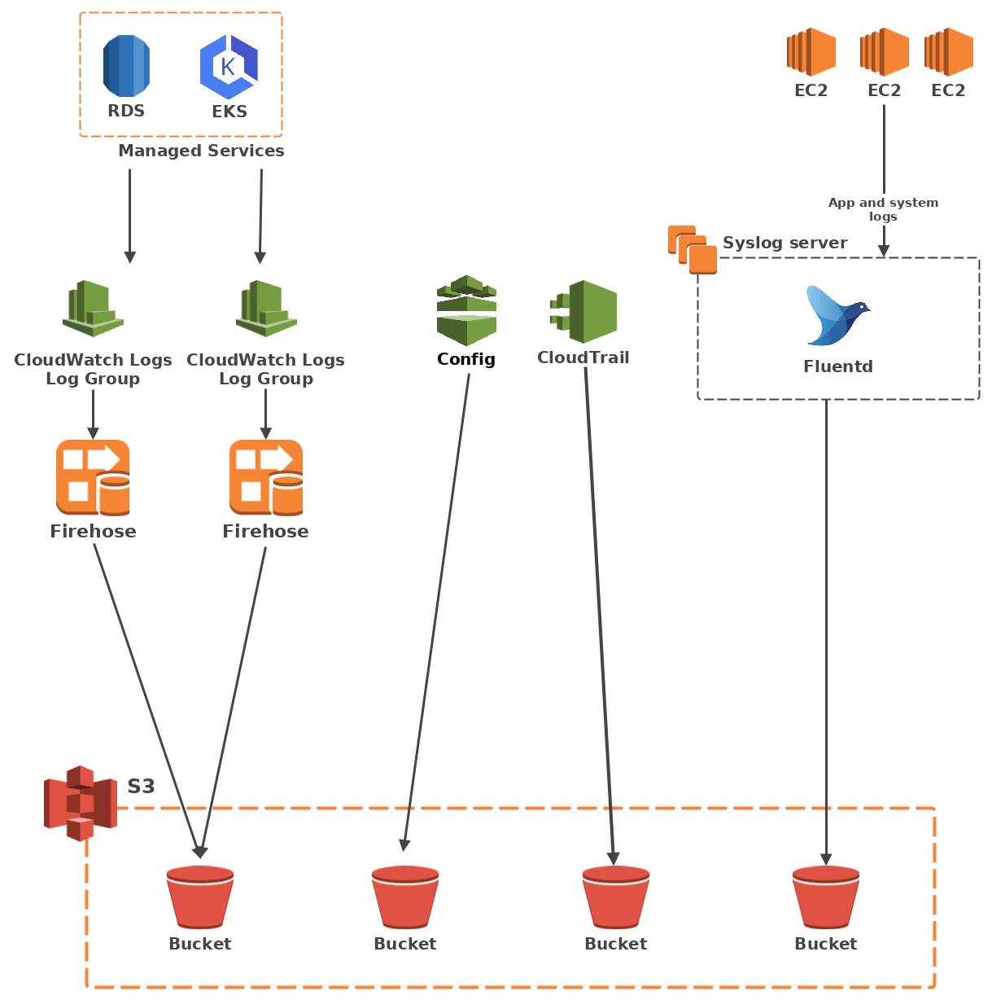
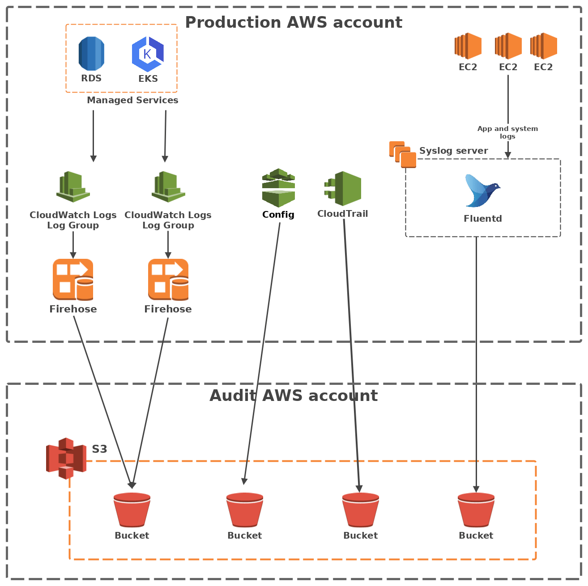

###### This article was originally published on [Polyconseil's tech blog](https://tech.polyconseil.fr/handling-logs-on-aws.html).


As we migrate our IT systems to the [AWS](https://aws.amazon.com/) cloud, it is imperative for us to be able to monitor their health and security. AWS does provide a range of tools for logging, however they feel fragmented and balky at times. Looking through logs in the dedicated AWS services was awkward at best, frustrating at worst, and definitely time-consuming. We needed a centralised, robust log storage and management infrastructure that we could control. So I built one!

## [Why we needed something else](#why-we-needed-something-else)

To best describe why we felt limited by AWS' "default" logging services, we will look at a few real world cases.

### The logon logs

At some point, I needed to check who logged onto the AWS web console and what [IAM role](https://docs.aws.amazon.com/IAM/latest/UserGuide/id_roles.html) they were using. A simple enough task. All I need to do is use [CloudTrail](https://aws.amazon.com/cloudtrail/).

So I login, go to CloudTrail, and look at a large table of indecipherable resource and user UIDs.



As it happens, I was interested in a few different columns, so I displayed them in that table. The already overloaded table became totally unusable. I downloaded the exportable CSV file and filtered it with Excel. Unfortunately though, I could not find what I was looking for in that file. Why? I was using CloudTrail in the wrong region, obviously.

This work flow is not optimal.

### The data transfer health-check

We use AWS [Kinesis Firehose](https://aws.amazon.com/kinesis/data-firehose/) to transfer data from point A to point B. To check the pipeline's health, Firehose's home page provides a monitoring tab that looks like this:



A fine dashboard, that only goes 7 days back. If you want to check your pipeline's health over a longer time span, you'll need to go to CloudWatch.

Again, this is not bad, it works when you have few things to monitor, but it does not scale well.

### The kubernetes logs

We use AWS' managed [Kubernetes](https://kubernetes.io/) solution, [Elastic Kubernetes Service](https://aws.amazon.com/eks/). EKS dumps its logs in [CloudWatch Logs](https://docs.aws.amazon.com/), and it has a whole lot of them.

The default CloudWatch Logs view of a given log stream looks like this.



I would personally prefer not to be reading that all day long.

> **What do we do now?**
>
> JSON log one-liners are better off on some disk somewhere than on your screen. We're used to neat monitoring solutions such as [Prometheus](https://prometheus.io/) and [Splunk](https://www.splunk.com/). We would like to keep using them. So all we need to do now is feed them with all those new AWS logs.

## [Our log management infrastructure](#our-log-management-infrastructure)

### Requirements

As a security engineer, my "security" requirements are the following:

* All logs must be stored in a central repository
* The central repository must be redundant
* No data loss
* Engineers must not have write access to the repository (a special permission is required)
* Log rotation must be automated (data protection authorities put a lot of emphasis on deleting old data)


### Storage solution choice

Given the above requirements, I could already see that our log management system would at least have a storage base (datalake, datahub, call it what you will) and a processing factory that would provide the dashboards and search capabilities.

I started looking for the most cost-effective log storage solutions to the requirements above. [AWS S3](https://aws.amazon.com/s3/) was a prime candidate.
Creating multiple S3 buckets for log storage is simple. AWS provides S3 bucket [replication within its regions](https://docs.aws.amazon.com/), and guarantees 99.999999999% durability and 99.99% availability thus ensuring the logs' safety. Encryption and rotation are also quite simple to automate in S3 buckets. 

So we took the S3 route for log storage.

### Sources

Let's now look at our log producing sources.

Since we were looking to build a cloud native system as we migrate towards the cloud, we've integrated AWS managed services in our environment. Here's a non-exhaustive list of the services that we use:

* Route53
* Config
* RDS
* ECR
* EKS
* ElasticSearch

These services dump their logs to different AWS logging services, instead of having a single one. As a result, AWS log handling might look like a hodgepodge to the untrained eye. So let's try to clear things out.


| Log source         | Destination       |
|--------------------|-------------------|
| [Route53][1]       | CloudWatch Logs   |
| [Config][2]        | Directly to S3    |
| [RDS][3]           | CloudWatch Logs   |
| [ECR][4]           | CloudTrail        |
| [EKS][5]           | CloudWatch Logs   |
| [ElasticSearch][6] | CloudTrail        |


[1]: https://docs.aws.amazon.com/Route53/latest/DeveloperGuide/query-logs.html#query-logs-configuring
[2]: https://docs.aws.amazon.com/config/latest/developerguide/how-does-config-work.html
[3]: https://docs.aws.amazon.com/AmazonRDS/latest/UserGuide/USER_LogAccess.html
[4]: https://docs.aws.amazon.com/AmazonECR/latest/userguide/logging-using-cloudtrail.html
[5]: https://docs.aws.amazon.com/eks/latest/userguide/control-plane-logs.html
[6]: https://docs.aws.amazon.com/elasticsearch-service/latest/developerguide/es-managedomains-cloudtrailauditing.html

We also have a fair amount of [EC2 instances](https://aws.amazon.com/ec2/) running on our [VPCs](https://aws.amazon.com/vpc/). For the sake of simplicity, we will imagine that they're all configured to send their logs to a single [syslog server](https://en.wikipedia.org/wiki/Syslog), that is also hosted on an EC2 instance.

In short, we can say that all our logs come from 4 different sources:

1. CloudWatch Logs
1. CloudTrail
1. Config
1. The syslog server

Connecting them to S3 reliably and securely while respecting our [immutable infrastructure philosophy](https://www.digitalocean.com/community/tutorials/what-is-immutable-infrastructure) is the fun part. Let's delve into it.


### Technical architecture

The aim now is to build a pipeline between each of these sources and an S3 bucket.

#### CloudWatch Logs

CloudWatch Logs groups data in [log groups](https://docs.aws.amazon.com/AmazonCloudWatch/latest/logs/Working-with-log-groups-and-streams.html) of multiple log streams. While CloudWatch Logs does not provide a default way of publishing logs to S3, it does provide a way to send logs to a [Kinesis Firehose](https://aws.amazon.com/kinesis/data-firehose/) thanks to a [subscription filter](https://docs.aws.amazon.com/AmazonCloudWatch/latest/logs/SubscriptionFilters.html). And as it happens, Firehose can dump data into S3. All that remains to get the logs flowing is to create the appropriate [IAM roles](https://docs.aws.amazon.com/IAM/latest/UserGuide/id_roles.html), which will be assumed by the subscription filter and the Firehose resources, as well as an adequate S3 [bucket policy](https://docs.aws.amazon.com/AmazonS3/latest/dev/example-bucket-policies.html).

#### CloudTrail

CloudTrail logs all API calls made to your resources, and calls them "trails". Thankfully AWS has already done the plumbing work to pipe your trails to an S3 bucket with little work on our part. Just set a destination bucket with the correct bucket policy for the trail you want and wait for the magic to happen.

#### Config

The same goes for AWS Config. Provide a bucket with a policy that allows Config to dump logs to it, create a [configuration recorder](https://docs.aws.amazon.com/config/latest/developerguide/stop-start-recorder.html) and a [delivery channel](https://docs.aws.amazon.com/config/latest/developerguide/manage-delivery-channel.html), and the latter will ship all your logs to S3.

#### The syslog server

As for the EC2 logs, the log collection server needs to handle both syslog inputs and S3 outputs. [FluentD](https://www.fluentd.org/) does that thanks to the [in_syslog](https://docs.fluentd.org/input/syslog) and [out_s3](https://docs.fluentd.org/output/s3) plugins, so we went with that.

#### Architecture overview



#### To S3 and beyond

As previously stated, we use multiple monitoring tools. Downloading batches of files from S3 and grepping them was not going to cut it. Luckily, most software has some kind of mechanism to fetch logs from S3. [Splunk has an add-on](https://splunkbase.splunk.com/app/1876/) that [connects to an SQS queue](https://docs.splunk.com/Documentation/AddOns/released/AWS/ConfigureAWS) to get logs from an S3 bucket. [Elastic](https://www.elastic.co/) has a [similar plugin](https://www.elastic.co/guide/en/logstash/current/plugins-inputs-s3.html).

From here on in, it's a matter of configuring your favourite log management app to handle what you'd like to send its way.

## [What we learned](#what-we-learned)

### Security stuff

#### IAM

IAM is hard. AWS makes it simpler with [IAM actions](https://docs.aws.amazon.com/IAM/latest/APIReference/API_Operations.html), which goes a long way towards really implementing [least privilege access](https://en.wikipedia.org/wiki/Principle_of_least_privilege). Our DevOps engineers do need some permissions to be able to work efficiently though, and those include permissions over S3 objects. That puts our S3 log buckets at risk if they were in the same [AWS account](https://aws.amazon.com/account/) as production resources. I could use IAM [boundaries](https://docs.aws.amazon.com/IAM/latest/UserGuide/access_policies_boundaries.html), but given the amount of resources we run, handling secure access policies would have been a bugfest.

The simple solution to this problem is to move the log buckets elsewhere, to a separate [AWS account](https://aws.amazon.com/account/) within the same [organisation](https://aws.amazon.com/fr/organizations/). The buckets in that account only allow write access to specific resources from the production account. As for read access, I chose to open it to any resource in the security account and to the resources that carry our monitoring tools. Though very tight IAM control to the log account is still necessary.

#### Data protection

As per security best practices, I need to make sure logs are both encrypted and rotated at the end of their lifespan.

Fortunately, encryption is merely a matter of ticking a box, and [S3 lifecycle management](https://docs.aws.amazon.com/AmazonS3/latest/dev/object-lifecycle-mgmt.html) allows you to move or delete logs automatically. You can even set it to change storage tiers for cost optimisation purposes.

#### Architecture overview



### The gotchas

Transferring data between 2 different AWS accounts adds a layer of complexity to your regular IAM roles and resource policies. To illustrate, I will focus here on the CloudWatch Logs to S3 through Firehose pipeline, as it was the trickiest.

Connecting Firehose to an outside S3 bucket proved particularly finicky, because contrary to regular AWS services, the S3 bucket policy must not simply trust the Firehose service, but rather the role it assumes in the production account.

You also have to make sure your S3 bucket policies provide read access to the resources you want, as well as write access to your log pipeline. While that may seem simple in theory, it took us a few lengthy hours of debugging to set straight.

Last but not least, also make sure you set the [trust policies](https://docs.aws.amazon.com/IAM/latest/UserGuide/id_roles_create_for-user.html) correctly on your IAM roles to only allow Firehose to write to the buckets.

Here are a few code snippets that will hopefully help you replicate our Firehose log delivery pipeline at home.

#### IAM role to be assumed by the CloudWatch Logs subscription filter to send logs to Firehose

IAM policy:

```
    {
        "Statement": [
            {
                "Effect": "Allow",
                "Action": [
                    "firehose:Put*",
                    "firehose:List*",
                    "firehose:Describe*",
                ],
                "Resource": [
                    "<YOUR FIREHOSE ARN>"   
                ]   
            }   
        ]
    }
```

Trust policy:

```
    {
      "Version": "2012-10-17",
      "Statement": [
        {
          "Effect": "Allow",
          "Principal": {
            "Service": "logs.<YOUR AWS REGION>.amazonaws.com"
          },
          "Action": "sts:AssumeRole"
        }
      ]
    }
```

#### IAM role to be assumed by Firehose to send logs to S3

IAM policy:

```
    {
        "Statement": [
            {
                "Effect": "Allow",
                "Action": [
                    "s3:AbortMultipartUpload",
                    "s3:GetBucketLocation",
                    "s3:ListBucket",
                    "s3:ListBucketMultipartUploads",
                    "s3:PutObjectAcl",
                    "s3:PutObject"
                ],
                "Resource": [
                    "<YOUR S3 BUCKET ARN>",
                    "<YOUR S3 BUCKET ARN>/*"
                ]
            }
        ]
    }
```

Trust policy:

```
    {
      "Version": "2012-10-17",
      "Statement": [
        {
          "Sid": "",
          "Effect": "Allow",
          "Principal": {
            "Service": "firehose.amazonaws.com"
          },
          "Action": "sts:AssumeRole",
          "Condition": {
            "StringEquals": {
              "sts:ExternalId": [
                "<YOUR PRODUCTION ACCOUNT ID>"
              ]
            }
          }
        }
      ]
    }
```

#### S3 bucket policy

```
    {
        "Version": "2012-10-17",
        "Statement": [
            {
                "Effect": "Allow",
                "Principal": {
                    "AWS": "<YOUR FIREHOSE ASSUMED ROLE ARN>"
                },
                "Action": [
                    "s3:AbortMultipartUpload",
                    "s3:GetBucketLocation",
                    "s3:GetObject",
                    "s3:ListBucket",
                    "s3:ListBucketMultipartUploads",
                    "s3:PutObject",
                    "s3:PutObjectAcl"
                ],
                "Resource": [
                    "<YOUR S3 BUCKET ARN>",
                    "<YOUR S3 BUCKET ARN>/*"
                ]
            }
        ]
    }
```

### Automate or die

If you try to do all of this manually in the AWS console, or with the CLI, you are going to have a bad time.
There are too many resources, links, roles and policies to create and configure. Building the log pipeline for a new log source will take just as much time as the first log pipeline you built. This does not scale.

In our cloud native environment, our systems are probably going to grow constantly. So we've stuck to a simple motto.

> **Our cloud motto**
> 
> On the cloud, it's either automated or it does not exist.

I used [Terraform](https://www.terraform.io/) to automate our log pipeline. This way, the development and debugging are done only once, and you can reliably and repeatably create all the resources for a log pipeline with a single command. This is also important to security minded folks like me, because it means fellow DevOps engineers have an easy time popping up the log infrastructure for a new service and are thus less likely to leave it indefinitely in their backlog.

### It's not perfect

Our AWS log pipeline is great. It does have quirks however.

#### Delay

With our on-premise systems, we're used to having logs transferred, ingested and processed instantaneously. That is not possible on the AWS cloud. [Firehose buffers](https://aws.amazon.com/kinesis/data-firehose/faqs/) log delivery, so real-time log processing is not possible.

#### Cost

When I built our log pipeline, we needed something that worked well quickly. So I optimised for security, not cost. S3 object lifecycle management helps a lot in that regard as it allows to move old data to cheaper storage. However, AWS logging services are not free, nor is Firehose. 

While this architecture is not particularly expensive, as part of our continuous AWS cost management efforts, we are currently looking for better cost saving measures.

## [Takeaway](#takeaway)

Sending logs to storage seems simple enough, yet it took us a while to figure out, as we had to build a cloud specific architecture.

As a security engineer working with a large DevOps team, my main objective was to provide them with straightforward grab and go answers for all their logging needs. That is why I built a log management infrastructure on AWS using common AWS managed services to deliver logs to our ingest stations. 

AWS are always bringing new features and improvements to their services, so the ideal log management infrastructure is a moving target, but I think we can be proud of ours.
