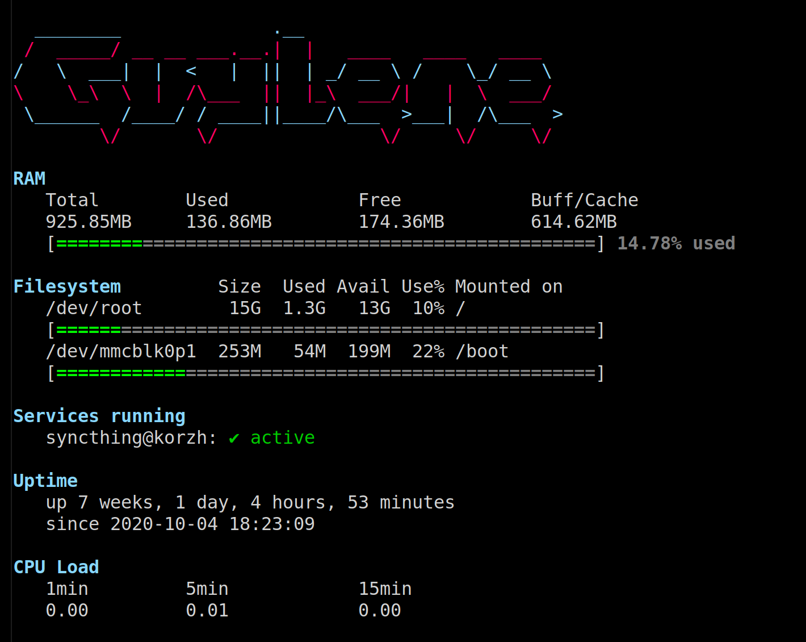

At home, I run 3 machines as small servers, but I haven't set up a monitoring system. Honestly, I probably never will.

So I did the next best thing: a nice MOTD.



## [Inspiration](#inspiration)

A friend who's also an IT engineer showed me this [reddit post](https://www.reddit.com/r/unixporn/comments/8gwcti/motd_ubuntu_server_1804_lts_my_motd_scripts_for/), and the associated [Github repo](https://github.com/Heholord/FalconStats/).

These two articles were also quite useful [ownyourbits.com article](https://ownyourbits.com/2017/04/05/customize-your-motd-login-message-in-debian-and-ubuntu/) and [linuxconfig.org](https://linuxconfig.org/how-to-change-welcome-message-motd-on-ubuntu-18-04-server).


## [Scripts](#scripts)

### RAM usage

```bash
#!/bin/bash                                                                                                                                     

bar_fill="="                                                                                                                                        
bar_empty="\033[1;90m=\033[0m"                                                                                                                                                                       
endpost_left="["                                                                                                                                                    
endpost_right="]"                                                                                                                                                       
line="   "

echo -e "\n\033[1m\e[38;5;117mRAM\e[0m\033[0m"
echo -e "   Total\tUsed\t\tFree\t\tBuff/Cache"

free | cut -d':' -f 2 -sz | while read totl used free shared bufc available rest; do
  totl_mb=$(echo "scale=2;"$totl" / 1024" | bc -l)
  used_mb=$(echo "scale=2;"$used" / 1024" | bc -l)
  free_mb=$(echo "scale=2;"$free" / 1024" | bc -l)
  bufc_mb=$(echo "scale=2;"$bufc" / 1024" | bc -l)

  echo -e "$line"$totl_mb"MB\t"$used_mb"MB\t"$free_mb"MB\t"$bufc_mb"MB"
  
  output=$endpost_left
  percent=$(echo "scale=0; 100 * "$used" / "$totl | bc -l)
    # 0-69 colored green
    for ((i=1; i<=34; i++))
    do
        if [ $(($percent / 2 + 2)) -gt $i ]
        then
            output+="\033[1;92m$bar_fill\033[0m"
        else
            output+=$bar_empty
        fi
    done

    # 70-84 colored yellow
    for ((i=35; i<=42; i++))
    do
        if [ $(($percent / 2 + 2)) -gt $i ]
        then
            output+="\033[1;93m$bar_fill\033[0m"
        else
            output+=$bar_empty
        fi
    done

    # 85-100 colored red
    for ((i=43; i<=50; i++))
    do
        if [ $(($percent / 2 + 2)) -gt $i ]
        then
            output+="\033[1;91m$bar_fill\033[0m"
        else
            output+=$bar_empty
        fi
    done
    output+=$endpost_right" "
    output+="\033[1;90m"$(echo "scale=2; 100 * "$used" / "$totl | bc -l)"% used\033[0m"
  echo -e "   "$output
done
```

### Disk usage

```bash
#!/bin/bash

bar_fill="="
bar_empty="\033[1;90m=\033[0m"
endpost_left="["
endpost_right="]\n"
line="   "
declare -a df_disks=()


# df command to get disk usage
declare df_disks=$(df -h | grep '^/dev' | grep -v '/dev/loop' | grep -v '/boot/efi')

echo ""
echo -e "\033[1m\e[38;5;117mFilesystem\e[0m\033[0m $line     Size  Used Avail Use% Mounted on"

IFS=$'\n'
for df_line in $df_disks
do
    echo "$line$df_line"

    output=$endpost_left
    diskPercent="$(sed 's/%.*//' <<< "$df_line" | grep -oP "\S+$" )"
    
    # 0-69 colored green
    for ((i=1; i<=34; i++))
    do
        if [ $(($diskPercent / 2 + 2)) -gt $i ]
        then
            output+="\033[1;92m$bar_fill\033[0m"
        else
            output+=$bar_empty
        fi
    done

    # 70-84 colored yellow
    for ((i=35; i<=42; i++))
    do
        if [ $(($diskPercent / 2 + 2)) -gt $i ]
        then
            output+="\033[1;93m$bar_fill\033[0m"
        else
            output+=$bar_empty
        fi
    done

    # 85-100 colored red
    for ((i=43; i<=50; i++))
    do
        if [ $(($diskPercent / 2 + 2)) -gt $i ]
        then
            output+="\033[1;91m$bar_fill\033[0m"
        else
            output+=$bar_empty
        fi
    done
    output+=$endpost_right
    printf "$line$output"
done
```

### Services

```bash
#!/bin/bash

ServiceFile="/etc/update-motd.d/services-list.txt"

declare -a serviceStatus=()
declare -a servicesName=()

readarray -t servicesName < $ServiceFile

# Get status of all services
for service in "${servicesName[@]}"
do
    if [ -n "$service" ]; then
        serviceStatus+=($(systemctl is-active "$service.service"))
    fi
done

# Maximum column width
width=$((49-2))

# Current line and line length
line="   "
lineLen=0

echo ""
echo -e "\033[1m\e[38;5;117mServices running\e[0m\033[0m"

longest=$(wc -L $ServiceFile | sed -e 's/\s.*$//')

for i in ${!serviceStatus[@]}
do
    # Next line and next line length
    next=" ${serviceName[$i]}: \e[5m${serviceStatus[$i]}"
    nextLen=$((1+${#next}))

    # If the current line will exceed the max column with then echo the current line and start a new line
    if [[ $((lineLen+nextLen)) -gt width ]]; then
    echo -e "$line"
    lineLen=0
    line="   "
    fi

    lineLen=$((lineLen+nextLen))

    # Color the next line green if it's active, else red
    if [[ "${serviceStatus[$i]}" == "active" ]]; then
    line+="${servicesName[$i]}: \e[32m✔ ${serviceStatus[$i]}\e[0m "
    else
    line+="${servicesName[$i]}: \e[31m▲ ${serviceStatus[$i]}\e[0m "
    fi
done

# echo what is left
echo -e "$line"
```

### Uptime & CPU Load

```bash
#!/bin/bash

# R  cup  rer le loadavg
read one five fifteen rest < /proc/loadavg

echo ""
echo -e "\033[1m\e[38;5;117mUptime\e[0m\033[0m"
echo "   "$(uptime -p)
echo -e "   since"  $(uptime -s)
echo ""
echo -e "\033[1m\e[38;5;117mCPU Load\e[0m\033[0m"
echo -e "   1min\t\t5min\t\t15min"
echo -e "   $one\t\t$five\t\t$fifteen\n"
```

## [License](#license)

### MIT License

Original work copyright (c) 2018 Heholord & HermannBjorgvin 

Modified work copyright (c) 2020 ctdhr Daher


Permission is hereby granted, free of charge, to any person obtaining a copy
of this software and associated documentation files (the "Software"), to deal
in the Software without restriction, including without limitation the rights
to use, copy, modify, merge, publish, distribute, sublicense, and/or sell
copies of the Software, and to permit persons to whom the Software is
furnished to do so, subject to the following conditions:

The above copyright notice and this permission notice shall be included in all
copies or substantial portions of the Software.

THE SOFTWARE IS PROVIDED "AS IS", WITHOUT WARRANTY OF ANY KIND, EXPRESS OR
IMPLIED, INCLUDING BUT NOT LIMITED TO THE WARRANTIES OF MERCHANTABILITY,
FITNESS FOR A PARTICULAR PURPOSE AND NONINFRINGEMENT. IN NO EVENT SHALL THE
AUTHORS OR COPYRIGHT HOLDERS BE LIABLE FOR ANY CLAIM, DAMAGES OR OTHER
LIABILITY, WHETHER IN AN ACTION OF CONTRACT, TORT OR OTHERWISE, ARISING FROM,
OUT OF OR IN CONNECTION WITH THE SOFTWARE OR THE USE OR OTHER DEALINGS IN THE
SOFTWARE.
