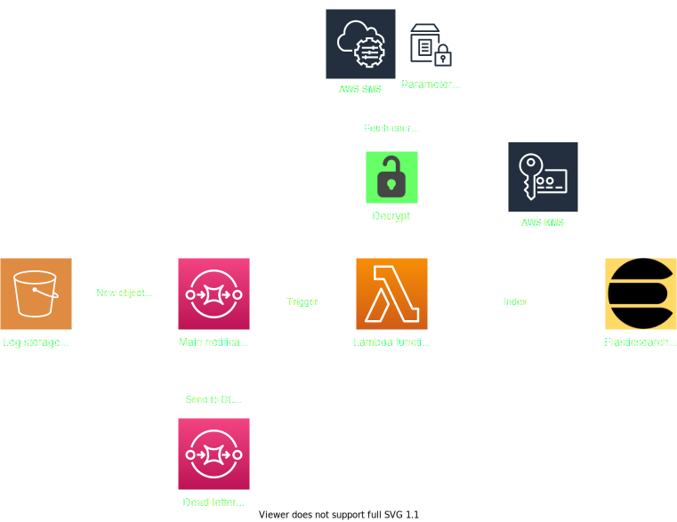

{:refdef: style="text-align: center;"}
{:height="112px"}
{: refdef}

If you ask the devops team running a SaaS service about the biggest weakness in their current production infrastructure, chances are they'll tell you "monitoring and logging".
When the pressure to deliver is high on a devops team, as with any team, projects that do not directly contribute to serving stakeholders are put on hold, ergo the previous answer.

That means that the organisation's security team is, at worst, flying blind, and at best, going through hoops and loops to get their job done.

## New logs, new problems

This was the situation I was in recently. I was working on adding a new security solution to the SaaS delivery infrastructure that my colleagues and I maintain.
This solution could only dump its logs to S3 buckets, and I needed a way to transfer those logs to the log analysis platform.

If that was Splunk, I'd have used Splunk's AWS add-on, [as mentioned in a previous blog post](../../pages/2019-08-19-aws_logs).
In this instance, it was an [Elasticsearch](https://www.elastic.co/elasticsearch/) deployment running on [Elastic Cloud](https://www.elastic.co/cloud/), and the devops team did not have a plug & play integration for this use case.

So once again, I had to come up with my own pipeline.

## How *not* to fly blind

### Filebeat

Elastic only recently (october 2019) rolled out "native" S3 log ingestion thanks to [Filebeat](https://www.elastic.co/beats/filebeat), and they've written a [great blog post about it](https://www.elastic.co/blog/getting-aws-logs-from-s3-using-filebeat-and-the-elastic-stack).
Going down this route would require me to set up a dedicated Filebeat on some kind of permanent compute resource.
I could either run it in an EC2 instance, or as a container in an orchestrated cluster, Kubernetes for instance.

Using an EC2 VM means we'd have another ["pet" machine](https://www.hava.io/blog/cattle-vs-pets-devops-explained) to monitor and update.
Pet setup and pet upkeep are expensive. No pets then.

If I wanted to set up Filebeat in a Kubernetes cluster, I'd have to use either a [ReplicaSet](https://kubernetes.io/fr/docs/concepts/workloads/controllers/replicaset/) or a [DaemonSet](https://kubernetes.io/docs/concepts/workloads/controllers/daemonset/) to ~~ensure~~/increase the probability there's at least one available pod to do the job.
That would definitely be a much shrewder use of compute resources.
But these pods could go on for hours without having to process a single log file, simply because the security service does not produce many of them during off peak hours, so we have to think again.

### Lambdas

Enter [Lambdas](https://aws.amazon.com/lambda/). For this particular case, a Lambda made more sense to me simply because it consumed compute resources only when necessary, and because it was relatively quick to set up.

In this scenario, the log producer aggregated logs by default before pushing them to S3, so we were never going to get real time logs in Elasticsearch.
As such, the small latency added by a Lambda's spin up is no issue. If low latency was a requirement, a Lambda wouldn't be the right tool.

## Requirements

First off, let's analyze what our pipeline needs to do.

### Send logs to the log analysis platform

The main goal of the Lambda is to index logs that are stored in S3.

The Elasticsearch deployment has an endpoint I could query to index logs as I please, just like a [Splunk HTTP Event Collector](https://docs.splunk.com/Documentation/Splunk/8.1.0/Data/UsetheHTTPEventCollector).
So my lambda had to authenticate with the endpoint using secret credentials.

Hard coding the credentials in the Lambda's code is obviously out of the question.

### Never lose a log file

Losing logs is not acceptable, so this system must handle common failure modes (e.g. network timeouts), and notify whenever an unrecoverable error occurs.

### Summing up the requirements

> Req :zero: The Lambda must index logs in Elasticsearch.

> Req :one: The Lambda must fetch the credentials to access ES from a secure storage location.

> Req :two: The Lambda must retry failed log insertions.

> Req :three: An alert must be fired if a log fail fails to be indexed after multiple retries.

## The nitty gritty

This is what the pipeline ended up looking like.

### Architecture overview

The chain starts with the S3 log bucket. Whenever the log producer stores a new file in the bucket, a notification message is written to an SQS queue.

This, in turn, triggers the Lambda. The Lambda reads the message and fetches the newly created object from the S3 bucket.

To write the log file's contents to Elasticsearch, the Lambda first fetches the encrypted credentials from the [SSM parameter store](https://docs.aws.amazon.com/fr_fr/systems-manager/latest/userguide/systems-manager-parameter-store.html).
Then, it decrypts them with the KMS key that was used to encrypt them. Using the decrypted credentials, the Lambda can now index the log file's contents in Elasticsearch.

When the Lambda successfully processes the file, it deletes the corresponding SQS message from the queue.

#### IAM permissions

The Lambda's execution role must include access permissions to:
 * the S3 log bucket
 * the SSM parameters containing the encrypted ES credentials
 * the KMS encryption key
 * the SQS notification queue

#### What happens if the Lambda fails?

The message will **not** be deleted from the SQS queue. It will go back to the queue once its [visibility timeout](https://docs.aws.amazon.com/AWSSimpleQueueService/latest/SQSDeveloperGuide/sqs-visibility-timeout.html) expires.
It can trigger a second Lambda execution. This behaviour is a sort of "retry mechanism" that is natively baked into SQS.

#### What happens if the Lambda keeps failing?

The message will keep on being sent back to the queue, until it maxes out its retry counter, aka `maximum receive count` (this value can be customised).
When the `maximum recieve count` is reached, the message is "redriven" to a [*Dead Letter Queue*](https://docs.aws.amazon.com/AWSSimpleQueueService/latest/SQSDeveloperGuide/sqs-dead-letter-queues.html).

An engineer can then read the message from the Dead Letter Queue to understand why the Lambda failed to process it, and potentially fix the Lambda.

### Does this really work?

Yes! Absolutely. This pipeline has been running in production for the last few weeks with no problems whatsoever.
Of course, I took the time to work out all the quirks to get it to a stable state, and here's what I learned.

* You need to "manually" encrypt the ES credentials before storing the ciphertext in the SSM parameter store
  - That's a pain
  - I recommend using [Vault](https://www.vaultproject.io/) to store the cleartext values, and Terraform to encrypt the values on the fly and store them on SSM
* The Lambda can timeout if the log file is too large
  - In such a case, there's no fix other than increasing the allowed execution time
* Network timeouts happen very often
  - Sometimes networks work in mysterious ways...
  - I recommend setting a minimum `max receive count` of 5
* A message's visibility timeout and the Lambda's allowed execution time can clash
  - If a message's visibility timeout is lower than the Lambda's maximum allowed time, the message could be visible again in the queue before the Lambda finishes processing it, thus triggering a second execution of the Lambda on the same message
  - I recommend setting the SQS messages' visibility timeout to a value higher than the Lambda's timeout
* The Dead Letter Queue must remain empty
  - A non-empty DLQ means the Lambda failed to process one or more messages
  - I recommend setting an alarm of some sort so you can get a notification if the DLQ ever gets a message
* Not all SQS messages have the same structure
  - The Lambda's code must be able to handle shape-shifting messages

## Wrapping up

Lambdas are yet another tool to add to a security engineer's arsenal.
They're quite nifty when it comes to handling small recurring workloads with minimal upfront time investment.
They can scale very well too, but that might not be the best solution financially speaking.

I've deployed three instances of this pipeline so far, using modular [Terraform](https://www.terraform.io/) code, and might expand its use to other areas of our infrastructure as the number of log producers steadily rises.

If you have any questions, get in touch on [LinkedIn](https://www.linkedin.com/in/daherk)!
